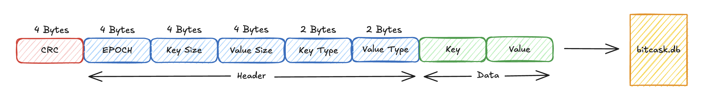

# Bitcask

A simple and efficient key/value store written in Ruby, inspired by the concepts outlined in this [guide](https://dineshgowda.com/posts/build-your-own-persistent-kv-store/#contents:given-a-cursor-at-the-location-of-the-data-in-file-will-you-be-able-to-read-the-data).

## Goals

1. **Low latency** reads/writes for quick data access.
2. **High throughput**, capable of handling large volumes of operations.
3. **Handles large datasets**, including those that exceed available RAM.
4. **Durable storage**, providing reliable data persistence and integrity.

## Implementation

The following diagram illustrates the structure of how data is stored, including the header metadata and key-value storage.



### Hash and Header

- **4 bytes** (uint32): [CRC](https://en.wikipedia.org/wiki/Cyclic_redundancy_check) hash.
- **4 bytes** (uint32): [Epoch](https://en.wikipedia.org/wiki/Unix_time) timestamp.
- **4 bytes** (uint32): **Key size** in bytes.
- **4 bytes** (uint32): **Value size** in bytes.
- **2 bytes** (uint16): **Key type** (String, Integer, Float...).
- **2 bytes** (uint16): **Value type** (String, Integer, Float...).

### Key and Value

- Each key and value can be up to **2^32-1 bytes** (4.29GB) in size.

## Usage

```ruby
store = Bitcask::DiskStore.new('bitcask.db')
store.put('key', 'value')
store.get('key') # => 'value'
```
